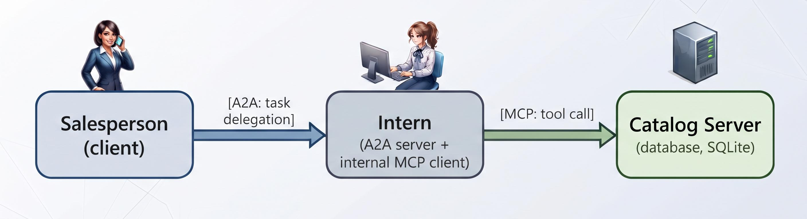

# MCP + A2A - Demo Project 

A working, end-to-end system that shows MCP and A2A together:



- **Catalog Server** (`catalog_server/`): exposes the product catalog (SQLite) as four MCP tools via Streamable HTTP.
- **Intern** (`intern/`): an A2A server that, when it receives a task, runs an LLM agentic loop that calls MCP tools to fulfill it.
- **Salesperson** (`salesperson/`): an A2A client that reads the Intern's Agent Card and delegates a natural-language task to it.

Tested with: `mcp==1.9.4`, `a2a-sdk==0.3.7`, `openai`, Python 3.12.
LLM backend: **Groq** (free tier). Default model: `qwen/qwen3.6-27b`.

## Quick Start

**Step 1 -- Get a free Groq API key** (no credit card required):
1. Go to [console.groq.com](https://console.groq.com) and create an account
2. Navigate to **API Keys** → **Create API Key**, and copy the key (starts with `gsk_`)

**Step 2 -- Install and configure:**
```bash
git clone <repo-url> && cd mcp_a2a_demo
python3 -m venv venv && source venv/bin/activate
pip install -r requirements.txt
echo 'GROQ_API_KEY=gsk_...' > .env
```

**Step 3 -- Run:**
```bash
./run_demo.sh "find me electronics under 20 euros"
```

The script seeds the database, starts all three components, streams live reasoning from the Intern, and shuts everything down on exit. Logs go to `logs/catalog.log` and `logs/intern.log`.

---

## Running manually (three terminals)

Useful if you want to watch each component's output independently.

```bash
# Terminal 1 — Catalog Server (port 8100)
cd catalog_server && python server.py

# Terminal 2 — Intern (port 9000)
cd intern && LOG_REASONING=1 python server.py

# Terminal 3 — Salesperson
cd salesperson && python client.py "find me electronics under 20 euros"
```

## Example queries

```bash
./run_demo.sh "find me electronics under 20 euros"
./run_demo.sh "home products under 10 euros"
./run_demo.sh "what product categories do you have?"
./run_demo.sh "compare the two cheapest electronics"
```

## What you'll see

```
[Salesperson] Discovered 'Intern': Answers questions about the company product catalog
[Salesperson] Skills offered: ['search-products']       <- A2A: what Salesperson sees

[Salesperson] Delegating task to Intern: "find me electronics under 20 euros"
[Intern] task status -> working
[Intern] LLM → query_products(max_price=20, category="electronics")  <- MCP: internal
[Intern] MCP  <- query_products returned 3 item(s)
[Intern] LLM → stop (final answer ready)
[Intern] task status -> completed

--- Artifact returned by Intern ---
Here are the electronics available under 20 euros:

- Wireless Mouse -- 14.99 EUR
- Phone Stand -- 9.99 EUR
- USB-C Cable 1m -- 6.50 EUR
```

The Salesperson never calls the database directly. It delegates via A2A to the Intern, which decides which MCP tools to call, runs them, and returns a final answer.

## MCP tools available

| Tool | Parameters | Description |
|------|-----------|-------------|
| `query_products` | `max_price`, `category?` | Search products at or below a price, optionally filtered by category |
| `get_product` | `product_id` | Look up a single product by id |
| `get_catalog_summary` | _(none)_ | Aggregate stats: categories, counts, price ranges |
| `compare_products` | `product_ids` | Side-by-side comparison of multiple products by id |

## Where each protocol lives in the code

**MCP layer:**
- `catalog_server/server.py` — defines the four MCP tools (`@mcp.tool()`) and starts the server. Provider side.
- `intern/mcp_client.py` — `mcp_session()` context manager that opens a connection to the Catalog Server. Consumer side.

**A2A layer:**
- `intern/server.py` — builds the Agent Card and starts the A2A server.
- `salesperson/client.py` — reads the Agent Card, submits a task, and streams the result.

**The agentic loop (where MCP and A2A meet):**
- `intern/executor.py` — discovers MCP tools via `list_tools`, sends schemas to the LLM, executes tool calls via MCP, feeds results back, repeats until the LLM stops.

## Optional logging flags

Set before starting the Intern (or pass inline: `LOG_REASONING=1 python server.py`):

- **`LOG_REASONING=1`** — prints each tool call the LLM chooses and the MCP result.
- **`LOG_SCHEMA=1`** — prints the full tool schemas discovered from the MCP server at the start of each request. Useful for demonstrating the "tool schema as contract" point: rename a parameter in `catalog_server/server.py` and the Intern adapts automatically, with no code change.

## Troubleshooting

- `ConnectionRefusedError` from Salesperson: make sure the Catalog Server is running before the Intern. With `run_demo.sh` this is handled automatically.
- If you change a port, update it in all three components (`MCP_SERVER_URL` in `intern/mcp_client.py`, `INTERN_URL` in `salesperson/client.py`).
- `GROQ_API_KEY` must be set before starting the Intern. Easiest: create a `.env` file (see `.env.example`).
